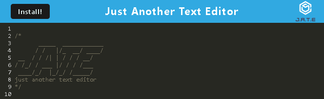

# Progressive Web App (Text Editor)

## Description

[Link to Text Editor](https://web-app-text-editor7.herokuapp.com/)

  - This text editor allows a user to create notes or code snippets with or without internet connection. The app uses an integrated service worker and Cache API's to allow the capablity for usage without internet.

## Installation

  - Install all NPM packages by entering "npm i" in the command line.

  - Then type "npm run start" to build the webpack and start the server.

## Usage

  - Once installed the user can type anything they need in the text editor. As long as the "cache" is not cleared and the browser has loaded at least once the text editor will work offline.

## Credits

  - https://github.com/Xandromus
  - https://github.com/AnthonyFrederick7

## Reference Links

  - https://www.w3schools.com/
  - https://developer.mozilla.org/

## License

N/A
